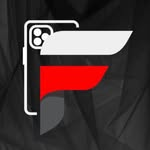

<div align="center">



# 📱 FILIPE CELL CELULARES

### Tecnologia, estilo e confiança em um só lugar.

<p>
  <strong>Landing Page oficial desenvolvida para a Filipe Cell Celulares</strong>
</p>

<br>

<a href="#-sobre-o-projeto">
  
</a>
<a href="#-tecnologias">
  
</a>
<a href="#-status">
  
</a>

</div>

---

<div align="center">


</div>

# 🚀 Sobre o Projeto

O **Filipe Cell Celulares** é uma landing page moderna, responsiva e focada em conversão, desenvolvida para apresentar a loja de celulares **Filipe Cell**, localizada em **Martinho Campos - MG**.

O projeto foi pensado para transmitir:

> 📱 Tecnologia  
> 🔥 Modernidade  
> 🛡️ Confiança  
> ⚡ Performance  
> 🎯 Conversão

A página apresenta os principais produtos e serviços da loja, além de direcionar os visitantes para os canais de atendimento.

---

# 🎯 Objetivo

O principal objetivo do projeto é criar uma presença digital profissional para a Filipe Cell e facilitar o contato entre a loja e seus clientes.

### A landing page possui:

- 📱 Apresentação da loja
- 🛒 Área de produtos
- ♻️ Destaque para troca de aparelhos
- 🔧 Seção de assistência
- 📍 Localização da loja
- 📸 Integração com Instagram
- 💬 Botões de contato
- 📱 Design responsivo
- ✨ Animações e microinterações
- 🌙 Interface Dark
- 🔴 Identidade visual baseada em preto e vermelho

---

# 🏪 Sobre a Filipe Cell

**Filipe Cell Celulares** é uma loja localizada em:

📍 **Rua Professor Coutinho, 151**  
📍 **Martinho Campos - MG**  
📮 **CEP: 35606-000**

A loja trabalha com:

📱 **Aparelhos lacrados**  
📱 **Aparelhos seminovos**  
♻️ **Troca de aparelhos usados**  
🔧 **Assistência**

---

# 🎨 Identidade Visual

O projeto utiliza a identidade visual da Filipe Cell baseada principalmente em:

<div align="center">

| Cor | Hexadecimal |
|---|---|
| 🔴 Vermelho | `#E50914` |
| ⚫ Preto | `#0B0D0F` |
| ⚪ Branco | `#FFFFFF` |
| 🌑 Cinza | `#25282D` |

</div>

O vermelho é utilizado como cor de destaque para chamadas, botões e elementos interativos.

O fundo escuro cria uma estética tecnológica e premium.

---

# 💻 Tecnologias

<div align="center">


</div>

### Utilizadas no projeto:

- HTML5
- CSS3
- JavaScript
- Responsive Design
- CSS Animations
- CSS Gradients
- Flexbox
- CSS Grid
- HTML Semântico

---

# ✨ Efeitos e Animações

Para deixar a experiência mais moderna, o projeto utiliza diversos efeitos visuais.

### 🔴 Glow vermelho

```css
.glow {
    box-shadow:
        0 0 10px rgba(229, 9, 20, 0.4),
        0 0 30px rgba(229, 9, 20, 0.2);
}
